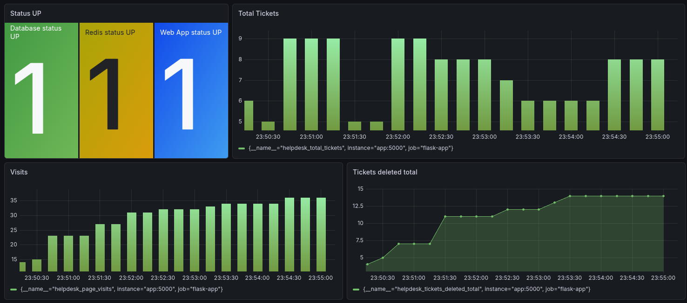

# Cloud Helpdesk

Simple container-based cloud computing project. The application is a small internal helpdesk where users can submit and delete IT issue reports.

## Dashboard Screenshot



Example dashboard content:
- app availability
- database and Redis status
- total tickets
- page visits
- deleted tickets over time

## Stack

- Nginx as reverse proxy
- Flask as the web application
- PostgreSQL for persistent ticket storage
- Redis for the page visit counter
- Prometheus for metrics collection
- Grafana for dashboard visualization

## Project Structure

```text
cs450-project/
├── app/
│   ├── app.py
│   ├── Dockerfile
│   ├── requirements.txt
│   ├── .dockerignore
│   ├── templates/
│   │   └── index.html
│   └── static/
│       └── style.css
├── nginx/
│   └── default.conf
├── prometheus/
│   └── prometheus.yml
└── docker-compose.yml
```

## Services

- `app`: Flask helpdesk application
- `nginx`: reverse proxy for the Flask app
- `postgres`: database for helpdesk tickets
- `redis`: in-memory store for page visits
- `prometheus`: metrics scraper
- `grafana`: metrics dashboard

## Ports

- App: `http://localhost:8080`
- Prometheus: `http://localhost:9090`
- Grafana: `http://localhost:3000`

## Run

```bash
docker compose down -v
docker compose up -d --build
docker ps
```

## Monitoring

Prometheus scrapes the Flask app on:

- target: `app:5000`
- path: `/metrics`

Available custom metrics:

- `helpdesk_total_tickets`
- `helpdesk_page_visits`
- `helpdesk_database_up`
- `helpdesk_redis_up`
- `helpdesk_tickets_deleted_total`

Useful Prometheus queries:

```promql
up
```

```promql
helpdesk_total_tickets
```

```promql
helpdesk_page_visits
```

```promql
helpdesk_database_up
```

```promql
helpdesk_redis_up
```

## Notes

- PostgreSQL data is stored in a Docker volume.
- Grafana connects to Prometheus with `http://prometheus:9090`.
- The app exposes metrics through Prometheus, and Grafana is used only for visualization.
